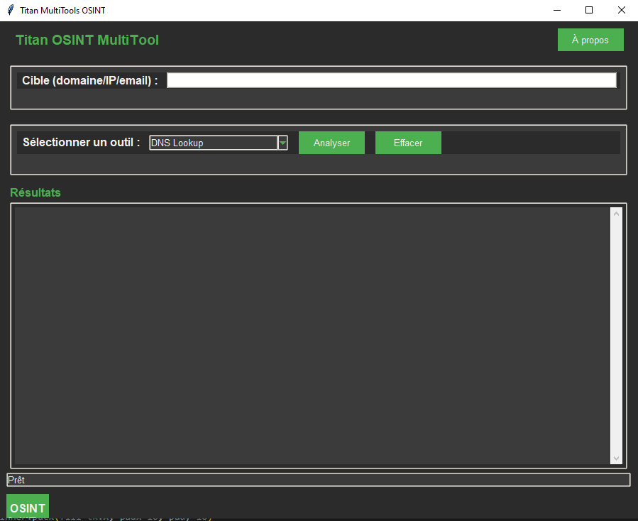

# Titan OSINT MultiTool


Un outil OSINT (Open Source Intelligence) multifonctions avec une interface graphique simple et élégante, développé en Python.

## 📋 Fonctionnalités

L'outil offre plusieurs fonctionnalités pour l'analyse OSINT :

- **DNS Lookup** - Recherche les informations DNS d'un domaine
- **Whois Lookup** - Obtient les informations d'enregistrement d'un domaine
- **IP Geolocation** - Localise une adresse IP géographiquement
- **Email Validator** - Vérifie la validité d'une adresse email
- **HTTP Headers** - Récupère les en-têtes HTTP d'un site web
- **Port Scanner** - Scanne les ports courants d'une adresse IP ou d'un domaine
- **Métadonnées Site Web** - Extrait les métadonnées d'un site web (titre, balises meta, liens externes, scripts)

## 🖼️ Captures d'écran



## 🚀 Installation

### Prérequis

- Python 3.6 ou supérieur
- pip (gestionnaire de paquets Python)

### Dépendances

Le programme nécessite les bibliothèques Python suivantes :
- `tkinter` (généralement inclus avec Python)
- `python-whois`
- `requests`
- `beautifulsoup4`
- `pillow`

### Installation des dépendances

```bash
pip install python-whois requests beautifulsoup4 pillow
```

### Exécution du programme

```bash
python osint_multitool.py
```

## 🔧 Utilisation

1. Lancez l'application
2. Entrez une cible (domaine, adresse IP ou email) dans le champ prévu
3. Sélectionnez l'outil que vous souhaitez utiliser dans le menu déroulant
4. Cliquez sur "Analyser" pour lancer l'analyse
5. Les résultats s'afficheront dans la zone de texte

### Raccourcis clavier

- `Entrée` : Lancer l'analyse
- `Échap` : Effacer les résultats
- `Ctrl+Q` : Quitter l'application
- `F1` : Afficher la fenêtre "À propos"

## ⚙️ Fonctionnalités en détail

### DNS Lookup

Cette fonctionnalité permet d'obtenir l'adresse IP associée à un nom de domaine, ainsi que de tenter une résolution inverse pour obtenir le nom d'hôte associé à une adresse IP.

### Whois Lookup

Récupère les informations d'enregistrement d'un domaine, y compris :
- Propriétaire
- Dates de création et d'expiration
- Serveurs de noms
- Informations de contact du registrant

### IP Geolocation

Localise une adresse IP géographiquement et fournit des informations comme :
- Pays
- Région
- Ville
- FAI
- Organisation
- Coordonnées géographiques
- Fuseau horaire

### Email Validator

Vérifie la validité d'une adresse email en :
- Contrôlant le format
- Vérifiant l'existence du domaine
- Recherchant des enregistrements MX (serveurs de messagerie)

### HTTP Headers

Récupère les en-têtes HTTP d'un site web, qui peuvent révéler :
- Le type de serveur
- La présence de technologies de sécurité
- Les politiques de cache
- Les types de contenu acceptés

### Port Scanner

Scanne les ports les plus courants d'une adresse IP ou d'un domaine pour déterminer quels services sont accessibles, comme :
- HTTP/HTTPS (ports 80, 443)
- SSH (port 22)
- FTP (port 21)
- SMTP (port 25)
- Et d'autres ports courants

### Métadonnées Site Web

Extrait les métadonnées d'un site web, notamment :
- Le titre de la page
- Les balises meta (description, mots-clés, etc.)
- Les liens externes
- Les scripts JavaScript

## 🛠️ Développement

### Structure du projet

```
osint-multitool/
├── osint_multitool.py        # Fichier principal
├── resources/                # Ressources (images, icônes)
│   └── logo.png
├── README.md                 # Ce fichier
└── requirements.txt          # Dépendances du projet
```

### Contribuer

Les contributions sont les bienvenues ! Pour contribuer :

1. Forkez le dépôt
2. Créez une branche pour votre fonctionnalité (`git checkout -b feature/amazing-feature`)
3. Committez vos changements (`git commit -m 'Add some amazing feature'`)
4. Poussez vers la branche (`git push origin feature/amazing-feature`)
5. Ouvrez une Pull Request


## ⚠️ Avertissement

Cet outil est fourni à des fins éducatives et de recherche uniquement. L'utilisation abusive de cet outil pour collecter des informations sur des individus ou des organisations sans leur consentement peut être illégale dans certaines juridictions. L'auteur n'est pas responsable de toute utilisation abusive de cet outil.

## 📞 Contact

Pour toute question ou suggestion, n'hésitez pas à ouvrir une issue dans le dépôt du projet.

---

Créé avec ❤️ pour la communauté OSINT
